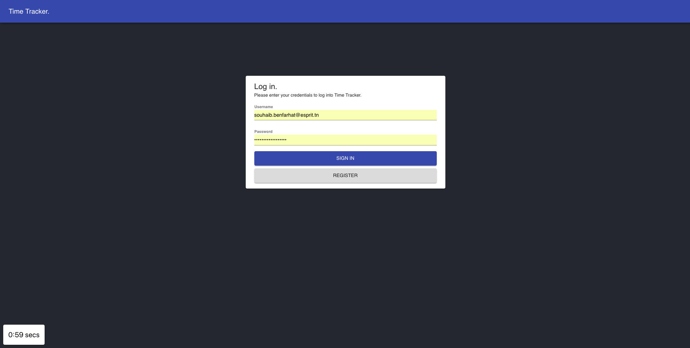
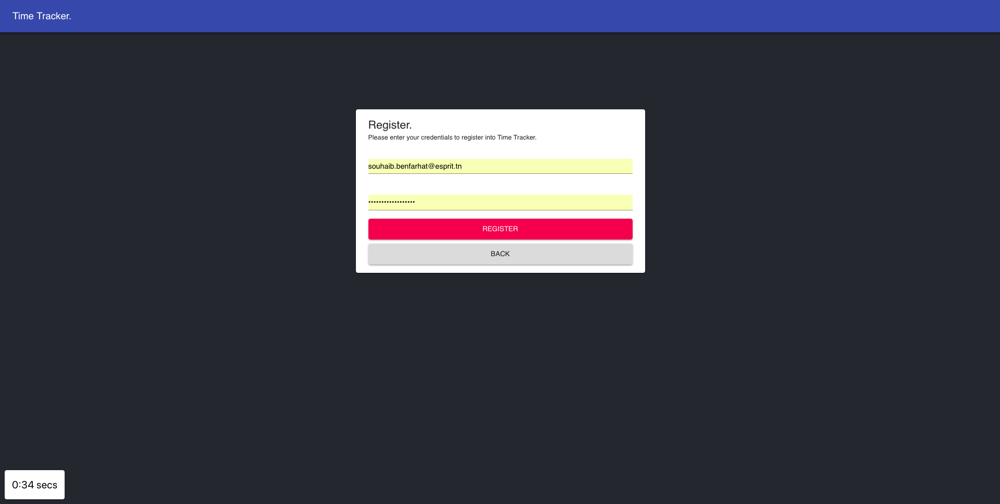
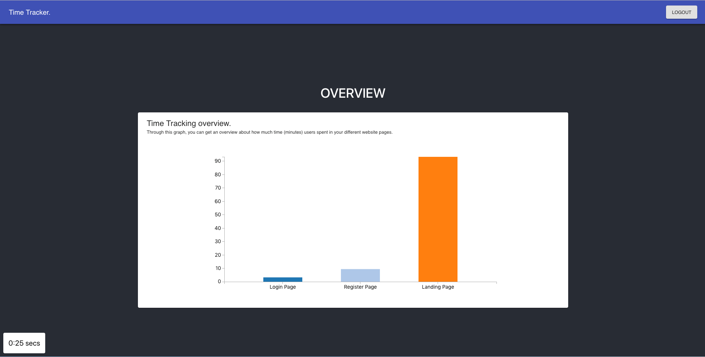

This project was bootstrapped with [Create React App](https://github.com/facebook/create-react-app).

Below you will find some information on how to perform common tasks.<br>
You can find the most recent version of this guide [here](https://github.com/facebook/create-react-app/blob/master/packages/react-scripts/template/README.md).

### How to run the app locally:

1. clone the repository<br>
``
git clone https://github.com/SouhaibBenFarhat/react-tracker.git
``
2. install dependencies<br>
go to the project folder and run 
``
yarn install 
``
or 
``
npm install
``

3. run the app 
``
yarn start
``
or 
``
npm start
``

4. Open browser and go to ``localhost:3000``


### Files structure:

```
react-tracker/
  config/
  node_modules/
  public/
    scripts/
      tracker.js
    index.html
    favicon.ico
  scripts/
  src/
    assets/
    components/
    services/
    utility/
    index.js
  package.json
  README.md
  yarn.lock

```

### Time tracker library:
[tracker.js](/public/scripts/tracker.js) the library is included into the  [index.html](/public/index.html)

```Please make sure to include JQuery in your webpage```

```html
<script src="https://code.jquery.com/jquery-3.3.1.min.js"
        integrity="sha256-FgpCb/KJQlLNfOu91ta32o/NMZxltwRo8QtmkMRdAu8="
        crossorigin="anonymous"></script>
```

````html
<script type="text/javascript"
        src="./scripts/tracker.js"
        host="http://localhost:4000"  <==== server url
        endpoint="/visit/init" <=== endpoint to init the session
        script-id="trackme" <=== script id
        container-id="timer-container" <=== html element id where you want to show the elpased time.
</script>
        
````

 
### Check list:

* [x] The time should only be tracked, if the user is actively browsing the site. If he is out of focus, in a different tab,the time should not be counted
* [x] The time tracked should be accurately and performantly send to the backend and saved in a database
* [x] You can use any javascript framework and/or vanilla javascript
* [x] The websites the users are browsing are not important. Use an existing template or create a simple web app you like
* [x] the javascript time tracking library should be stand alone and build in a way that anyone could add it to his application
* [x] The time tracked and saved should not be more than 5% off the time, the user is actually browsing the sites
* [x] Do not simply copy existing solutions, I know them :)
* [x] Do it by yourself


### ScreenShots
Login Page<br>
<br><br>
Register Page<br>
<br><br>
Landing Page<br>
<br><br>
